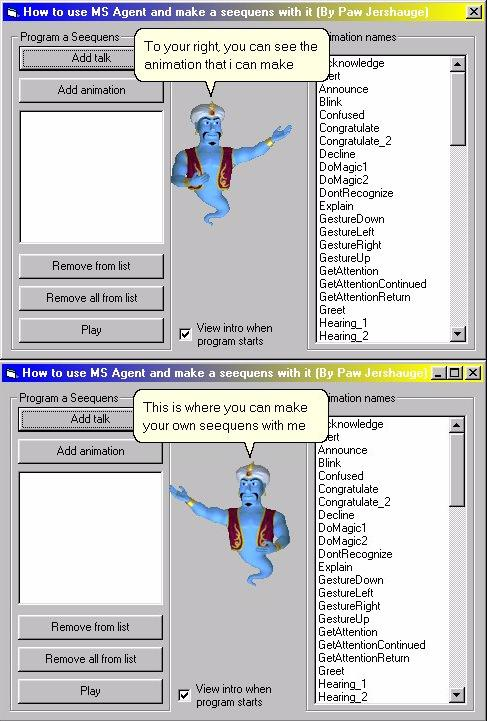



## A How to use MSAgent program \(GENIE\)

### Description

This code will show you how to use the play and speak functions. (Very EASY to use or make you own SEEQUENS)
 
### More Info
 
You need to have the MS Agent program installed an also you need to have the Genie character installed.

             |
---                |---
**Submitted On**   |2000-08-08 08:35:32
**By**             |[Paw Jershauge](https://github.com/Planet-Source-Code/PSCIndex/blob/master/ByAuthor/paw-jershauge.md)
**Level**          |Intermediate
**User Rating**    |4.5 (109 globes from 24 users)
**Compatibility**  |VB 5\.0, VB 6\.0
**Category**       |[Miscellaneous](https://github.com/Planet-Source-Code/PSCIndex/blob/master/ByCategory/miscellaneous__1-1.md)
**World**          |[Visual Basic](https://github.com/Planet-Source-Code/PSCIndex/blob/master/ByWorld/visual-basic.md)
**Archive File**   |[CODE\_UPLOAD8811892000\.zip](https://github.com/Planet-Source-Code/paw-jershauge-a-how-to-use-msagent-program-genie__1-10573/archive/master.zip)

